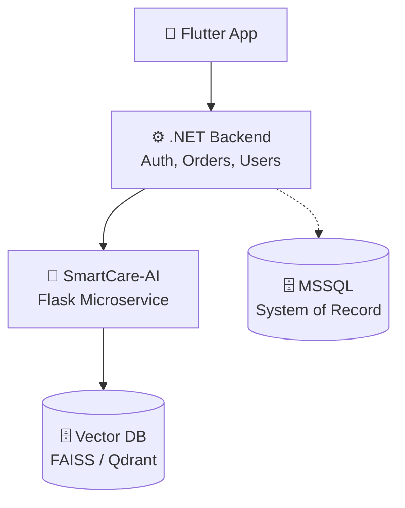

# 🧠 SmartCare-AI: Comprehensive Documentation

> ⚠️ **Disclaimer:** SmartCare-AI is **advisory only**. It does **not** prescribe medication or make autonomous medical decisions. Medical safety always comes before AI intelligence.

---

## 📌 1. Project Overview & Goals

**SmartCare-AI** is a robust AI microservice designed to empower an Online Pharmacy platform. It provides intelligent, assistive capabilities while maintaining strict medical safety boundaries.

### 🎯 Core Objectives
*   **Semantic Search:** Improve drug discovery by allowing users to search by meaning and symptoms rather than exact keywords.
*   **Drug Similarity:** Recommend similar or alternative drugs based on active ingredients, drug class, and indications.
*   **Contraindication Detection:** Detect potential risks between newly selected medications and previously purchased drugs.
*   **Safe Integration:** Seamlessly and safely integrate with a Flutter + .NET + MSSQL pharmacy ecosystem.

---

## 🏗️ 2. High-Level Architecture

SmartCare-AI is positioned as a downstream service from the main .NET backend. 

### 🔄 System Flow


### 🗝️ Key Architectural Principles
*   **MSSQL is the System of Record:** All source-of-truth data lives in the relational database.
*   **Vector DB is Derived Data:** Vector databases are rebuildable and stateless.
*   **AI is Isolated:** AI logic is encapsulated in this dedicated microservice.
*   **Deterministic Rules Override AI:** Hard medical rules always take precedence over AI suggestions.

---

## 🛠️ 3. Technology Stack & Frameworks

SmartCare-AI leverages a modern Python ecosystem for machine learning and web services.

| Category | Technology / Framework | Description |
| :--- | :--- | :--- |
| **Language** | Python 3.11+ | Core programming language. |
| **Web Framework** | Flask 3.0.0 | Lightweight web serving. Structured with Pydantic for data validation. |
| **Database & ORM** | SQLAlchemy 2.0, Alembic | For relational data access (MSSQL via `pyodbc`) and migrations. |
| **Vector Search** | FAISS, Qdrant | `faiss-cpu` for local/dev, `qdrant-client` for production. |
| **Machine Learning** | Transformers, Sentence-Transformers | HuggingFace ecosystem for embeddings and similarity. |
| **LLM Integration** | OpenAI API | For dynamic AI explainability and semantic risk generation. |
| **Data Validation** | Pydantic V2 | Strict type hints and schema validation for API requests/responses. |
| **Background Jobs** | APScheduler | For running async jobs like vector syncing and DB cleanups. |
| **Testing** | Pytest, Pytest-Flask | Comprehensive pipeline and API testing. |

---

## 🧠 4. AI Capabilities & Pipelines

All AI requests follow a strict, invariant pipeline:
`API Layer` ➔ `Service Layer` ➔ `Pipeline Layer` ➔ `Domain Rules` ➔ `Vector Search / AI` ➔ `Ranking` ➔ `Response`

### 🔍 4.1 Semantic Drug Search
Search drugs by their **meaning** rather than matching keywords. 
*   *Example:* `"medicine for headache without stomach pain"`
*   **Pipeline:** User Query ➔ Text Cleaning ➔ Embedding ➔ Vector Search ➔ Relevance Filter ➔ Safety Filter ➔ Ranking ➔ Response

### 💊 4.2 Similar Drug Recommendation
Find drugs with overlapping active ingredients, drug classes, or indications.
*   **Pipeline:** Drug ID ➔ Fetch Existing Embedding ➔ Vector Similarity Search ➔ Exclude Same Drug ➔ Safety Filter ➔ Ranking ➔ Response

### 🛑 4.3 Contraindication Detection (Safety-Critical)
Analyze risks between a new drug and existing prescriptions.
*   **Pipeline:** New Drug ➔ Deterministic Rule Engine (Hard Stop) ➔ Drug Class Overlap ➔ AI Semantic Risk Scan ➔ Explainability Builder ➔ Response

#### ⚖️ Decision Priority Model
| Priority | Source | Can Block |
| :---: | :--- | :---: |
| **1** | Deterministic Medical Rules | ✅ **Yes** |
| **2** | Drug Class Overlap | ⚠️ Warning |
| **3** | AI Semantic Risk Detection | ⚠️ Warning |
| **4** | AI / LLM Explanation | ❌ No |

---

## 🔌 5. Vector Database Strategy

Vector databases enhance intelligence but never compromise safety. They are **stateless** and completely **rebuildable**.

*   **Local / Development Environment:** `FAISS` (Facebook AI Similarity Search - CPU).
*   **Production Environment:** `Qdrant` (Scalable vector database).

### 🔄 Sync Strategy
Vector DBs sync from MSSQL via Background Jobs (`Jobs/`).
1.  **Event-Based:** Drug created/updated ➔ Emit event ➔ Re-embed drug.
2.  **Scheduled Sync:** Nightly jobs compare timestamps and rebuild embeddings if needed.

Changing the embedding model or dimension requires a **full vector rebuild**.

---

## 📡 6. API Documentation (Contracts)

**Base URL:** `/api/v1`

<details>
<summary><b>1. Semantic Search</b></summary>

*   **Endpoint:** `POST /semantic-search`
*   **Request:**
    ```json
    {
      "query": "medicine for headache without stomach pain",
      "top_k": 5
    }
    ```
*   **Response:**
    ```json
    [
      {
        "drug_id": 101,
        "score": 0.92
      }
    ]
    ```
</details>

<details>
<summary><b>2. Similar Drug Recommendation</b></summary>

*   **Endpoint:** `GET /similar-drugs/{drug_id}?top_k=5`
*   **Response:**
    ```json
    [
      {
        "drug_id": 88,
        "score": 0.87
      }
    ]
    ```
</details>

<details>
<summary><b>3. Contraindication Check</b></summary>

*   **Endpoint:** `POST /contraindications/check`
*   **Request:**
    ```json
    {
      "new_drug_id": 101,
      "previous_drug_ids": [22, 45]
    }
    ```
*   **Response:**
    ```json
    {
      "safe": false,
      "warnings": [
        {
          "type": "RULE",
          "message": "Warfarin + Aspirin increases bleeding risk"
        }
      ]
    }
    ```
</details>

<details>
<summary><b>4. System Health</b></summary>

*   **Endpoint:** `GET /health`
*   **Response:**
    ```json
    {
      "status": "ok"
    }
    ```
</details>

### 🛡️ API Guarantees
*   Versioned APIs for backward compatibility.
*   Unified Error Formatting.
*   AI results are strictly advisory.

---

## 💻 7. Development & Setup Guide

### 📋 Prerequisites
*   **Python 3.11+**
*   **MSSQL** (Local or Remote)
*   *Optional:* Docker (Recommended for running Qdrant locally)

### 🚀 Setup Instructions
1.  **Clone & Environment:**
    ```bash
    git clone <repo-url>
    cd SmartCare-AI
    python -m venv venv
    source venv/bin/activate  # Windows: venv\Scripts\activate
    ```
2.  **Install Dependencies:**
    ```bash
    pip install -r requirements.txt
    ```
3.  **Configuration:**
    Create a `.env` file from the example:
    ```bash
    cp .env.example .env
    ```
    *Configure: DB connection, Vector DB selection, API keys, Feature flags.*
4.  **Run the Application:**
    ```bash
    python run.py
    ```
    *Service starts at `http://localhost:8000`*
5.  **Run Tests:**
    ```bash
    pytest
    ```

---

## 🚫 8. Non-Goals & Compliance

To maintain regulatory compliance and patient safety, SmartCare-AI explicitly **DOES NOT**:
1.  **Diagnose diseases or conditions.**
2.  **Prescribe medication.**
3.  **Replace pharmacists or doctors.**
4.  **Act autonomously without explainability.**

### 🤝 Contribution Guidelines
*   Always follow the existing pipeline architecture.
*   Never bypass deterministic domain rules.
*   Keep all AI decisions explainable and auditable.
*   Ensure tests are written for all modified pipelines.
*   Update this documentation when changing system behavior.
